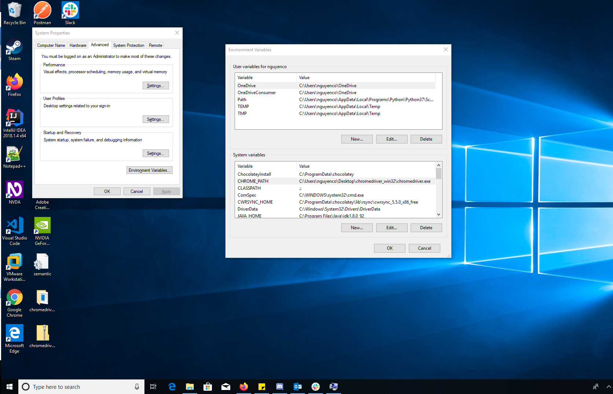

## Requirements:
>Python 3 (64 bit)    
>the package dependencies are in the requirements.txt file

# Instructions on how to run the twitter scrape

### Format for how the execution should be ran
`python scrapetweets.py --from_date YYYY-MM-DD --to_date YYYY-MM-DD [HASHTAGS (space separated without '#')]`

### Example
`python scrapetweets.py --from_date 2018-01-01 --to-date 2019-01-01 J35 Orcas`
> This will provide the tweets that include both hastags j35 and orcas from the time period of january 1 2018 to january 1 2019

### This is shorthand for the flags and also works
`python scrapetweets.py -F YYYY-MM-DD -T YYYY-MM-DD [HASHTAGS (space separated without '#')]`

### Example
`python scrapetweets.py -F 2018-01-01 -T 2019-01-01 J35 Orcas`

### Both date flags do not have to be specified. If only the from-date flag is set it will look for tweets from that to present. If only the to-date flag is set it will look for tweets up to that date
`python scrapetweets.py --from_date YYYY-MM-DD [HASHTAGS (space separated without '#')]` 
`python scrapetweets.py --to_date YYYY-MM-DD [HASHTAGS (space separated without '#')]`

### Example
`python scrapetweets.py --from_date 2018-01-01 J35 Orcas`
`python scrapetweets.py --to_date 2018-01-01 J35 Orcas`  

### The date parameters are optional, if no dates are specified it will run indefinitely until the tweets no longer load
`python scrapetweets.py [HASHTAGS (space separated without '#')]`

### Example
`python scrapetweets.py J35 Orcas`

## List of Features
- Scrapes Tweets based on user inputted tags  
- Scrapes Tweets based on user inputted dates  
- Places Tweets into excel file in same column  

## Initial Set Up Windows
### 1 Go to Python.org
- Click Downloads tab
- Click Download Windows x86-64 executable installer
### 2 Open/run the downloaded executable
- Click the checkbox to add Python 3.7 to path
- click install now
- After completing the installation the window can now be closed
### 3 In the command prompt navigate to where the scrapetweets.py program is located
- If you just downloaded the zip and extracted it the command below should be quite similar  
`cd Downloads\OrcasAnalysis-1.0\scrape`
### 4 Install Dependencies
- In the command prompt enter the following 
`pip install -r requirements.txt`
### 5 Download the Chrome Driver (manipulatable chrome browser)
- First find out what version of chrome you are running
- This can be done by going to the search menu on chrome, finding the help tab, and clicking on about google chrome
- This should take you to a page where it displays the version of chrome

- Now that you know the version of chrome you need head over to <https://chromedriver.chromium.org/downloads>
- Download the version of the web driver that matches the version of chrome you have

- After clicking the matching version it should ask you to download the zip you want
- Choose the win32.zip option as it will allow the program to be installed on Windows

### 6 Extract The Application to Desktop
- Go to where you downloaded the chrome driver and extract the executable to your desktop

### 7 Setting up environment variables
- In the windows search bar in the bottom left corner near the start menu search for "Edit environment variables"

- When the screen opens add a new environment variable to the system variables
- The name of the new variable has to be named CHROME_PATH and should be the path to the chrome driver you just installed and extracted

### 8 Finished and now you can run your scraper for Tweets
- The installation is now complete and you can run the tweet scraper with the execution instructions above

## Inital Set Up Mac
### 1 Follow the initial set up instruction on how to install Python3 on Mac
### 2 Install Pip
- in the command line type  
`curl https://bootstrap.pypa.io/pypa.io/get-pip.py -o get-pip.py`  
`python get-pip.py`
### 3 After installing pip, we need to install all the package dependencies.  
`pip install -r ../requirements.txt`  
`pip install -r requirements.txt`  
### 4 Download the Chrome Driver (manipulatable chrome browser)
- First find out what version of chrome you are running
- This can be done by going to the search menu on chrome, finding the help tab, and clicking on about google chrome (its in the same spot for both windows and mac)
- This should take you to a page where it displays the version of chrome

- Now that you know the version of chrome you need head over to <https://chromedriver.chromium.org/downloads>
- Download the version of the web driver that matches the version of chrome you have

- After clicking the matching version it should ask you to download the zip you want
- Choose the mac64.zip option as it will allow the program to be installed on Windows

### 5 Extract chrome driver to desktop
- After the zip is uncompressed move the chrome driver executable to anywhere on the desktop
### 6 Adding chrome_path to environment variables
- In the command line type  
`export CHROME_PATH="$HOME/Desktop/chromedriver"`
### 7 Finished and now you can run your scraper for Tweets
- The installation is now complete and you can run the tweet scraper with the execution instructions above
