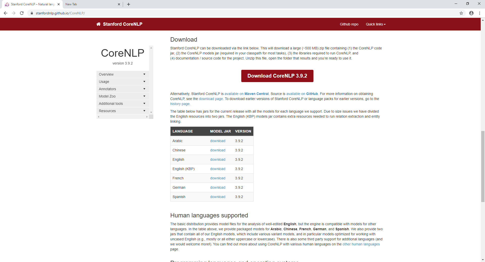
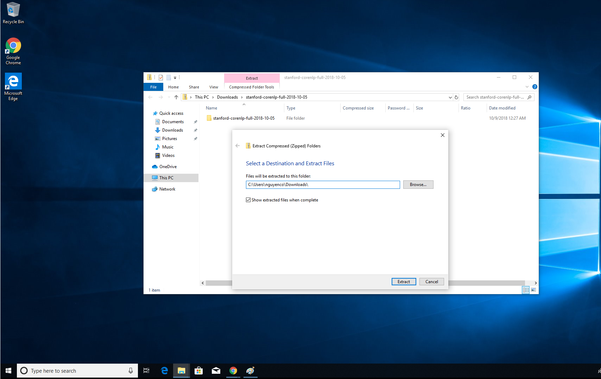
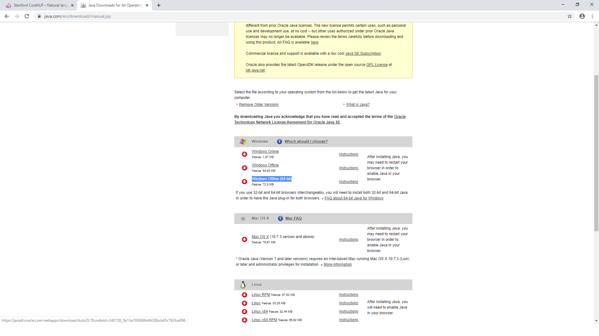
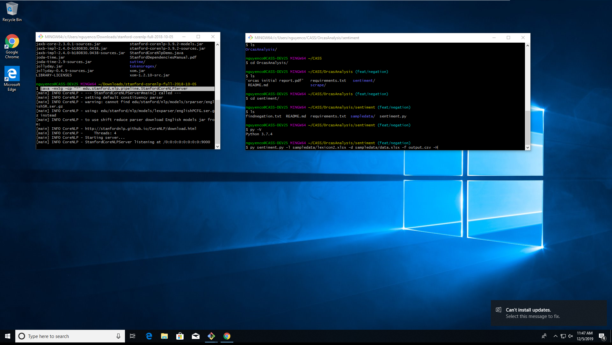

## Additional Set Up Required
### 1. Download Stanford CoreNLP Package
- Follow this link to Download the Newest Version of CoreNLP[https://stanfordnlp.github.io/CoreNLP/]

### 2. Extract Files from Downloaded Package
- Extract the files from zip file that was downloaded in step 1

### 3. Install Java 64 bit
- Install the Java 64 bit found here[https://java.com/en/download/manual.jsp]
- It should be the Windows Offline (64-bit)

### 4. Install Sentiment Specific Python Packages
- in the sentiment folder run the following command:  
`pip install -r requirements.txt`

### 5. Before you can run the sentiment program, the Stanford Server must be started
- Open a second instance of CMD prompt or bash
- Change into the extracted folder of the Stanford CoreNLP Package
- Run the following command:  
`java -mx5g -cp "*" edu.stanford.nlp.pipeline.StanfordCoreNLPServer`
- If there is an error that states that port is in use:  
`netstat -ano | findstr :9000`  
`taskkill /PID [THE NUMBER AFTER LISTENING] /F`  
- Re run the command:
`java -mx5g -cp "*" edu.stanford.nlp.pipeline.StanfordCoreNLPServer`

## 6 Instructions on how to run the sentiment analysis.

### Format for how the execution should be ran
`python sentiment.py -lexicon PATH_TO_LEXICON_SOURCE -data PATH_TO_DATA_SOURCE -file PATH_TO_OUTPUT_FILE -H`

### Example:
`python sentiment.py -lexicon sampledata/lexicon.xlsx -data sampledata/data.xlsx -file output.csv`

### This is shorthand for the flags and also works

`python sentiment.py -l PATH_TO_LEXICON_SOURCE -d PATH_TO_DATA_SOURCE -f PATH_TO_OUTPUT_FILE`

### Example:
`python sentiment.py -l sampledata/lexicon.xlsx -d sampledata/data.xlsx -f output.csv`

### If the output flag is not specified the program will default to put the results into a file named results.csv

### Example:
`python sentiment.py -l sampledata/lexicon.xlsx -d sampledata/data.xlsx`

### There is an optional parameter that prints out the row of headers for each column. For this flag to be set all that is needed is just to put -H in the command line

### Example with header
`python sentiment.py -l sampledata/lexicon.xlsx -d sampledata/data.xlsx -f output.csv -H`

### Setting up config [OPTIONAL]
- Below are the default negator, boundary, and punctuation terms.
- They will be used if the sheet, or columns do not exist or have size 0
- Negators = ["not", "no", "n't", "neither", "nor", "nothing", "never", "none", "lack", "lacked", "lacking", "lacks", "missing", "without", "absence", "devoid"]
- Boundary Words = ["but", "and", "or", "since", "because", "while", "after", "before", "when", "though", "although", "if", "which", "despite", "so", "then", "thus", "where", "whereas", "until", "unless"]
- Punctuation = [".", ",", ";", "!", "?", ":", ")", "(", "\"", "'", "-"]
- To create a custom config: In the Lexicon, Create a second sheet
- The First Column is designated for Negator Terms
- The Second Column is designated for Boundary Words
- The Third Column is designated for Punctuation  
- The names of the columns can be anything as it will be removed when read in, therefore the terms of use need to start at line 2 in each column.

## List of Features
- Using command line arguments knows where to read data from  
- Reads input from excel file for lexicon  
- Creates hashtables from lexicon data to make searching words O(1) operation  
- Reads input from excel file for data  
- Grabs all comments from all sheets  
- Only counts unique words into the sentiment  
- Edge Cases (divide by 0 or empty comment or weird punctuation)  
- Calculates sentiment based on positive and negative words in the comment  
- Tallies up all emotions in a comment  
- Outputs the corresponding data to specified file or default file  
- Able to negate terms based on boundary words and negatory terms
- Able to change configuration based on user demands
